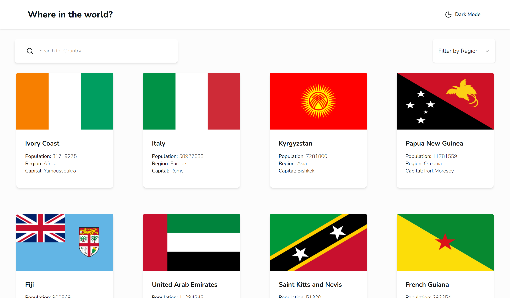

# 🌍 Rest Countries App

Aplicación web construida con **React** que consume la API de países para mostrar información detallada de cada nación, con filtros, búsqueda y modo oscuro.

---

## 🚀 Demo

🔗 [Ver aplicación en vivo](https://rest-countries-api-with-color-theme-gamma.vercel.app/?search=&region=Africa)

---

## 📸 Preview

<!-- podés agregar screenshots después -->



---

## 🧠 Funcionalidades

* 🔍 Búsqueda de países por nombre
* 🌎 Filtro por región
* 🌙 Modo oscuro / claro
* 📄 Vista detallada de cada país
* ⚡ Navegación con React Router
* ⏳ Skeleton loading mientras cargan los datos

---

## 🛠️ Tecnologías

* ⚛️ React
* ⚡ Vite
* 🎨 Tailwind CSS
* 🔄 React Router
* 🌐 REST Countries API
* 🦴 react-loading-skeleton

---

## 📦 Instalación

```bash
git clone https://github.com/feimb/rest-countries-api-with-color-theme-switcher-master
cd rest-countries-app
npm install
npm run dev
```

---

## 📂 Estructura del proyecto

```
src/
│── api/
│   └── countries.js

│── components/
│   ├── layout/
│   │   └── MainLayout.jsx
│   │
│   ├── skeleton/
│   │   ├── CardCountrySkeleton.jsx
│   │   └── CountryInfoSkeleton.jsx
│   │
│   ├── subComponents/
│   │   ├── DropDown.jsx
│   │   ├── InfoText.jsx
│   │   ├── Filter.jsx
│   │   └── Header.jsx
│   │
│   ├── CardCountry.jsx
│   ├── CountryInfo.jsx
│   └── NavBar.jsx

│── hooks/
│   └── useDark.js

│── pages/
│   ├── Home.jsx
│   └── Country.jsx

│── App.jsx
```

---

## ⚙️ API

Los datos se obtienen desde:

👉 https://restcountries.com/

---

## 📌 Aprendizajes

En este proyecto practiqué:

* Manejo de estado con hooks (`useState`, `useEffect`)
* Consumo de APIs con `fetch/axios`
* Manejo de rutas con React Router
* Manejo de query params (`useSearchParams`)
* Renderizado condicional (loading, empty states)
* Diseño responsive con Tailwind

---

## 🚧 Mejoras futuras

* 🔄 Debounce en la búsqueda
* ⭐ Favoritos
* 📊 Más detalles por país
* 🧪 Tests

---

## 👨‍💻 Autor

**Fei Mosqueda**

* GitHub: https://github.com/feimb

---

## ⭐ Si te gustó el proyecto

Podés darle una estrella al repo 🙌
